Multi-Agent Research System

A fully local, open-source multi-agent research orchestration system using Ollama, LangGraph, and LangChain.

## Demo




## How It Works

The pipeline is intentionally simple to explain and easy to demo:

- The **Planner** breaks the topic into 3–5 focused research questions.
- The **Researcher** answers each question using a ReAct loop with DuckDuckGo and Wikipedia, then normalizes findings into structured source-backed notes.
- The **Critic** checks whether the findings are specific, grounded, and sufficiently sourced, then either approves the run or sends it back for another pass.
- The **Writer** turns the approved findings into a markdown report and streams the output token by token to the UI.
- The **Supervisor Router** enforces the Critic→Researcher iteration cap so the system cannot loop forever.

The FastAPI backend streams status updates and writer tokens over SSE, while completed runs are saved to disk so they can be reviewed later.

## Architecture Overview

**Phase 1: Local Model Foundation** ✅
- Ollama installation and model management (llama3, mistral)
- Python wrapper for reliable local LLM completions
- Verification probes for completion reliability

**Phase 2: Single ReAct Agent** ✅
- DuckDuckGo search and Wikipedia retrieval tools
- ReAct (Reasoning + Acting) agent loop
- LangGraph StateGraph orchestration foundation

**Phase 3: Full Multi-Agent Orchestration** ✅
- **Planner**: Breaks research topic into 3–5 focused questions
- **Researcher**: Investigates each question using ReAct + tools
- **Critic**: Evaluates findings; approves or requests more research
- **Writer**: Synthesizes findings into structured markdown report
- **Supervisor Router**: Enforces iteration caps and manages Critic→Researcher feedback loop

**Phase 4: Enhanced Persistence & Evaluation** ✅
- **SqliteSaver Checkpointing**: Thread-scoped checkpointing for resumable research sessions
- **ChromaDB Semantic Memory**: MMR-retrieval-based vector store for cross-session fact reuse
- **Pydantic Structured Outputs**: Validated schema for findings, citations, and evaluations
- **Rubric-Based Evaluation**: Comprehensive scoring for citation quality, coverage, and coherence

## Setup & Installation

### 1) Install Ollama and pull models

Windows (PowerShell):
```powershell
winget install --id Ollama.Ollama -e
ollama pull llama3
ollama pull mistral
ollama serve  # Start the local Ollama API on localhost:11434
```

### 2) Install Python dependencies

```powershell
python -m pip install -r requirements.txt
```

### 3) Set PYTHONPATH and run

```powershell
$env:PYTHONPATH = "src"
python main.py          # Full orchestration with detailed topic (takes ~20–30min)
python test_quick.py    # Quick demo with simpler topic (takes ~5–10min)
python scripts/verify_ollama.py --model mistral --attempts 3  # Verify local models work
```

### Key Design Patterns

- **Shared State (AgentState)**: All agents read/write to a common TypedDict:
  - `topic`: Research subject
  - `plan`: Breakdown of research questions (Planner writes)
  - `findings`: Accumulated research results (Researcher writes)
  - `critique`: Evaluation feedback (Critic writes)
  - `report`: Final markdown output (Writer writes)
  - `iteration`: Loop counter (Supervisor reads to prevent infinite loops)

- **ReAct Pattern**: Researcher agent thinks → picks tool → observes result → repeats
  - Tools: DuckDuckGo, Wikipedia
  - Max 4 iterations per question to prevent timeouts

- **Conditional Routing**: Supervisor inspects `next_agent` field and enforces MAX_ITERATIONS (default=2)
  - Critic loops back to Researcher if "NEEDS_WORK"
  - After 2 loops, forces progression to Writer

## File Structure

```
.
├── README.md
├── requirements.txt
├── main.py                    # Full research orchestration
├── test_quick.py              # Quick demo variant
├── scripts/
│   └── verify_ollama.py       # Local model reliability probe
├── src/
│   └── local_llm/
│       ├── __init__.py
│       └── ollama_client.py   # Wrapper for Ollama API
└── agents/
    ├── __init__.py
    ├── state.py               # Shared AgentState definition
    ├── tools.py               # DuckDuckGo + Wikipedia tools
    ├── planner.py             # Planner agent node
    ├── researcher.py          # Researcher agent node (ReAct)
    ├── critic.py              # Critic agent node
    ├── writer.py              # Writer agent node
    └── graph.py               # LangGraph StateGraph orchestration
```

## Example Run

```powershell
$env:PYTHONPATH = "src"
python test_quick.py
```

Expected output:
```
Building graph...

[Quick test] Running research on: 'What is machine learning?'
================================================================================

[Planner] Created 4 research questions

[Researcher] Researching: 1. What is machine learning...
[Researcher] Researching: 2. What are common ML algorithms...
[Researcher] Researching: 3. How is ML different from...
[Researcher] Researching: 4. What are real-world applications...

[Critic] Approved after 1 iteration(s)

[Writer] Generating final report...

================================================================================
=== GENERATED REPORT ===

# Machine Learning: A Comprehensive Overview

## Executive Summary
...

## Key Concepts
...

## Algorithms and Techniques
...

## Applications
...

## Conclusion
...
```

## Performance Notes

- **Phase 3 full run**: ~20–30 minutes (depends on topic complexity, Ollama latency, feedback loops)
- **Quick test variant**: ~5–10 minutes
- **Bottleneck**: LLM inference time on local hardware (mistral ~5–10s/inference, llama3 ~10–15s/inference)
- **Typical Critic iteration flow**: 1–2 loops to approval (MAX_ITERATIONS=2 safety cap)

## Known Limitations

- **Local model quality varies**: Report quality depends on the current Ollama models and local hardware. Faster models can be less precise, while stronger models are slower.
- **Citation quality still depends on upstream research**: The Writer can only cite URLs that the Researcher actually captured. If the search results are sparse, citations may be thin.
- **Long runtimes for complex topics**: Multi-pass research and local inference can still take several minutes to produce a full report.

## Evaluation

The system includes a lightweight evaluation pass for each completed report:

- **has_citations**: checks whether the report contains URL-style citations
- **word_count**: counts total words in the final report
- **questions_covered**: counts how many structured findings were included in the final synthesis

This evaluation is intentionally simple. It provides a quick signal for demo visibility and future gating, but it is not a substitute for human review or a deeper rubric-based benchmark.

## Next Steps

- Add more specialized agents (Validator, Debater)
- Implement streaming output for real-time report generation
- Add persistence layer (save research state, findings cache)
- Build REST API for remote orchestration
- Add evaluation metrics (research quality, coverage, coherence)
- Integrate additional tools (scholarly databases, code execution)

